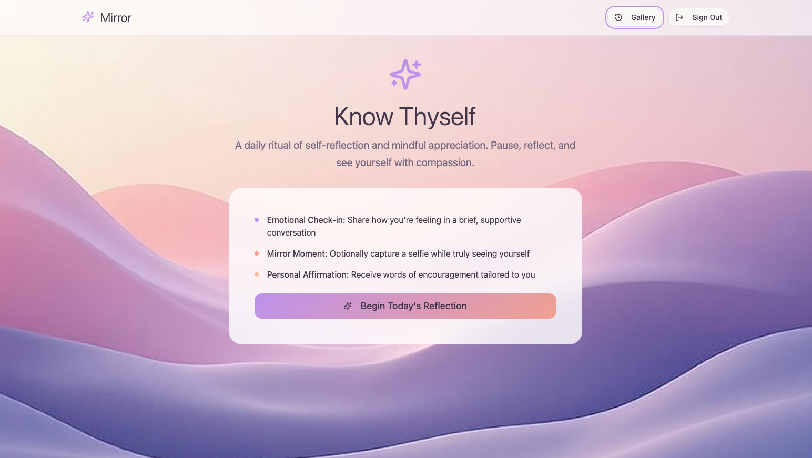
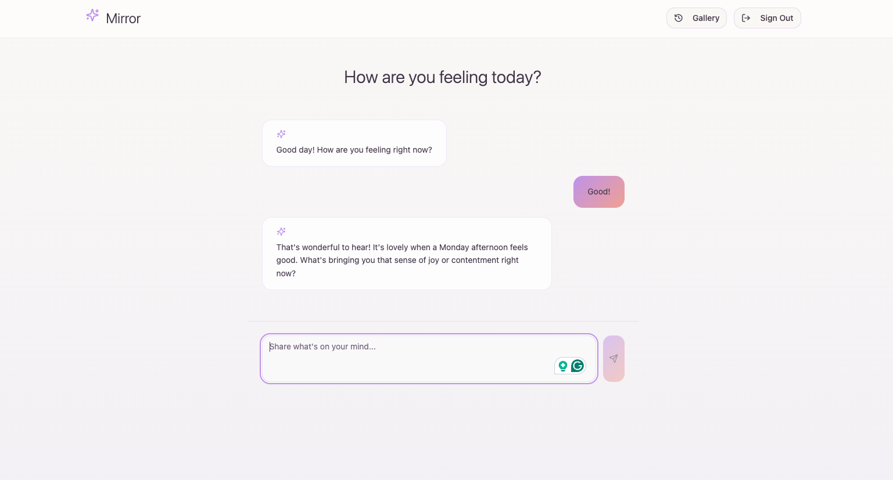
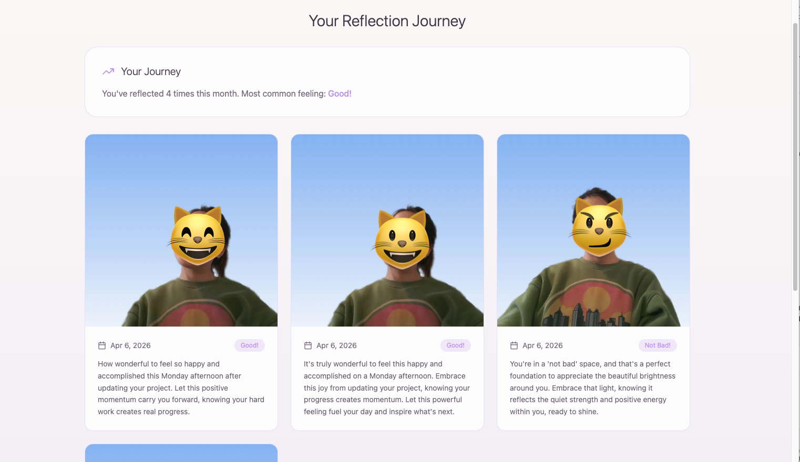

# Mirror Mirror

Hey! Welcome to **Mirror Mirror** — a project I built to help people slow down, check in with themselves, and celebrate small wins, one day at a time.

**What is Mirror Mirror?**  
It's a daily self-reflection companion where you chat mindfully, receive personalised affirmations based on your mood, and — if you want — snap a selfie. Each selfie is saved alongside your daily affirmation, so you can literally watch your self-growth over time in your own private gallery.

**Key Features:**  
- Guided, empathetic chat to help you reflect and process your feelings  
- Personalised, uplifting affirmations & encouragement  
- Daily selfie feature: Look yourself in the eye, capture a photo, and pair it with your affirmation  
- Private gallery: Revisit your journey — see your photos and words of kindness to yourself

**Tech Stack:**  
- Vite (development & build)  
- React + TypeScript (UI & logic)  
- shadcn-ui & Tailwind CSS (design system)  
- Supabase for backend & storage  
- Deno for running serverless functions  
- Google Gemini API for conversational AI and personalised affirmations

## Screenshots

### Welcome


### Chat Reflection


### Reflection Gallery


## Setup

### 1) Install and run

```sh
npm install
npm run dev
```

### 2) Frontend environment variables

Create `.env` in the project root:

```env
VITE_SUPABASE_URL=your_supabase_project_url
VITE_SUPABASE_PUBLISHABLE_KEY=your_supabase_publishable_key
GOOGLE_GEMINI_API_KEY=your_gemini_key
```

Notes:
- The frontend uses `VITE_SUPABASE_URL` and `VITE_SUPABASE_PUBLISHABLE_KEY`.
- `GOOGLE_GEMINI_API_KEY` in `.env` helps local/dev testing, but deployed Supabase Edge Functions read this key from Supabase project secrets.

### 3) Supabase project link

Link this repo to your own Supabase project:

```sh
supabase link --project-ref your_project_ref
```

### 4) Set Edge Function secret in Supabase

```sh
supabase secrets set GOOGLE_GEMINI_API_KEY="your_real_gemini_key"
```

### 5) Deploy Edge Functions

```sh
supabase functions deploy chat-reflection
supabase functions deploy generate-affirmation
supabase functions list
```

## Auth Notes

- If sign-in shows `Email not confirmed`, disable email confirmation in Supabase:
   - Authentication -> Providers -> Email -> Confirm email OFF
- If your function is protected and the user session is missing, function calls can return `401 Unauthorized`.

## Camera Notes (Chrome + macOS)

If selfie capture cannot access camera:

1. Open app in Chrome.
2. Click lock icon in address bar -> Site settings -> Camera -> Allow.
3. On macOS: System Settings -> Privacy & Security -> Camera -> enable Google Chrome.
4. Close apps that may be using the camera (Zoom, FaceTime, Teams, etc.).

## Troubleshooting

- `FunctionsFetchError`: function is unreachable or not deployed.
- `FunctionsHttpError (401)`: user session/JWT issue or function auth mode mismatch.
- `FunctionsHttpError (500)`: function runtime failed (often missing `GOOGLE_GEMINI_API_KEY` secret or Gemini API error).

---

If you try this out, I'd love to hear how the experience feels or if you have feature ideas!  

Thanks for checking out my project.  
— Grace
